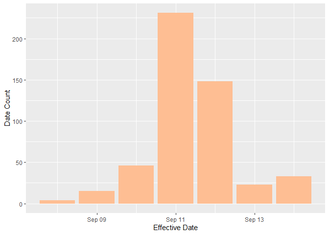
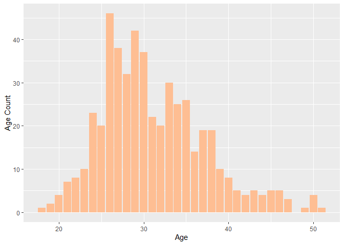
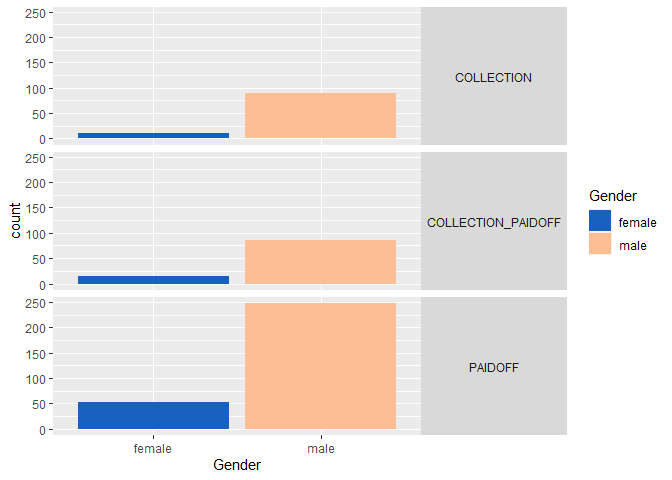
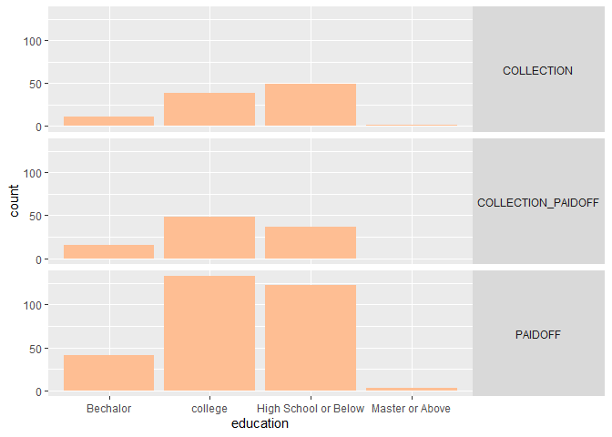
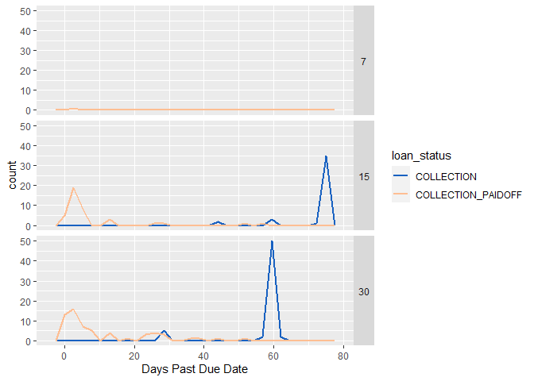
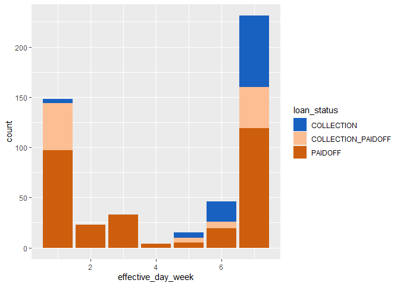

Exploratory Data Analysis in Loan Data dataset
================
PhuaJunYu

This is an R Markdown document to showcase my work in performing an
exploratory data analysis on the [Loan
Data](https://www.kaggle.com/datasets/zhijinzhai/loandata) dataset.

The main goal is to explore the dataset, look for trends, patterns, and
derive insights. See if anything interesting comes up and try to suggest
some actions based on the derived insights.

## Problems with the data

1.  Lack of demographic data, only age, education and gender info are
    available

2.  Only data in Sep to Nov in 2016, can’t derive any seasonal
    difference or trends from it.

3.  Also the time-effectiveness of the data is questionable as this
    analysis is carried out in Feb 2024.

4.  The data is relatively small, with only 500 rows of data.

5.  From the similarity of loan capital(mean 943.2, standard deviation
    115.2403), it seems that this data only represents a fraction of
    loan services provided.

## Data Inspection

Check the columns

``` r
# load the data
loan_data <- read.csv(r"(D:\Download\LoanData\Loan payments data.csv)")
# check basic info & structure
colnames(loan_data)
```

    ##  [1] "Loan_ID"        "loan_status"    "Principal"      "terms"         
    ##  [5] "effective_date" "due_date"       "paid_off_time"  "paid_off_date" 
    ##  [9] "past_due_days"  "age"            "education"      "Gender"

Look into the data

``` r
head(loan_data)
```

    ##       Loan_ID loan_status Principal terms effective_date  due_date
    ## 1 xqd20166231     PAIDOFF      1000    30       9/8/2016 10/7/2016
    ## 2 xqd20168902     PAIDOFF      1000    30       9/8/2016 10/7/2016
    ## 3 xqd20160003     PAIDOFF      1000    30       9/8/2016 10/7/2016
    ## 4 xqd20160004     PAIDOFF      1000    15       9/8/2016 9/22/2016
    ## 5 xqd20160005     PAIDOFF      1000    30       9/9/2016 10/8/2016
    ## 6 xqd20160706     PAIDOFF       300     7       9/9/2016 9/15/2016
    ##            paid_off_time paid_off_date past_due_days age            education
    ## 1        9/14/2016 19:31     9/14/2016            NA  45 High School or Below
    ## 2 10/7/2016  9:00:00 AM`     10/7/2016            NA  50             Bechalor
    ## 3        9/25/2016 16:58     9/25/2016            NA  33             Bechalor
    ## 4        9/22/2016 20:00     9/22/2016            NA  27              college
    ## 5        9/23/2016 21:36     9/23/2016            NA  28              college
    ## 6               9/9/2016      9/9/2016            NA  35      Master or Above
    ##   Gender
    ## 1   male
    ## 2 female
    ## 3 female
    ## 4   male
    ## 5 female
    ## 6   male

``` r
glimpse(loan_data)
```

    ## Rows: 500
    ## Columns: 12
    ## $ Loan_ID        <chr> "xqd20166231", "xqd20168902", "xqd20160003", "xqd201600…
    ## $ loan_status    <chr> "PAIDOFF", "PAIDOFF", "PAIDOFF", "PAIDOFF", "PAIDOFF", …
    ## $ Principal      <int> 1000, 1000, 1000, 1000, 1000, 300, 1000, 1000, 1000, 80…
    ## $ terms          <int> 30, 30, 30, 15, 30, 7, 30, 30, 30, 15, 7, 15, 30, 7, 7,…
    ## $ effective_date <chr> "9/8/2016", "9/8/2016", "9/8/2016", "9/8/2016", "9/9/20…
    ## $ due_date       <chr> "10/7/2016", "10/7/2016", "10/7/2016", "9/22/2016", "10…
    ## $ paid_off_time  <chr> "9/14/2016 19:31", "10/7/2016  9:00:00 AM`", "9/25/2016…
    ## $ paid_off_date  <chr> "9/14/2016", "10/7/2016", "9/25/2016", "9/22/2016", "9/…
    ## $ past_due_days  <int> NA, NA, NA, NA, NA, NA, NA, NA, NA, NA, NA, NA, NA, NA,…
    ## $ age            <int> 45, 50, 33, 27, 28, 35, 29, 36, 28, 26, 29, 39, 26, 26,…
    ## $ education      <chr> "High School or Below", "Bechalor", "Bechalor", "colleg…
    ## $ Gender         <chr> "male", "female", "female", "male", "female", "male", "…

## Data Cleaning

As the data is small, a manual inspection in MS Excel was carried out to
check issues in the data. And it turns out that the data has very little
problems.

No duplicates found.

``` r
# check for duplicates, null values and NAs
sum(duplicated(loan_data$Loan_ID))
```

    ## [1] 0

``` r
sum(duplicated(loan_data))
```

    ## [1] 0

No null values found.

``` r
# check for NULLs
for(col in colnames(loan_data)){
  print(paste(col,' NA:',sum(is.null(loan_data[col]))))
}
```

    ## [1] "Loan_ID  NA: 0"
    ## [1] "loan_status  NA: 0"
    ## [1] "Principal  NA: 0"
    ## [1] "terms  NA: 0"
    ## [1] "effective_date  NA: 0"
    ## [1] "due_date  NA: 0"
    ## [1] "paid_off_time  NA: 0"
    ## [1] "paid_off_date  NA: 0"
    ## [1] "past_due_days  NA: 0"
    ## [1] "age  NA: 0"
    ## [1] "education  NA: 0"
    ## [1] "Gender  NA: 0"

Check for NA/blank values

``` r
# check for NAs
for(col in colnames(loan_data)){
  print(paste(col,' NA:',sum(is.na(loan_data[col]))))
}
```

    ## [1] "Loan_ID  NA: 0"
    ## [1] "loan_status  NA: 0"
    ## [1] "Principal  NA: 0"
    ## [1] "terms  NA: 0"
    ## [1] "effective_date  NA: 0"
    ## [1] "due_date  NA: 0"
    ## [1] "paid_off_time  NA: 0"
    ## [1] "paid_off_date  NA: 0"
    ## [1] "past_due_days  NA: 300"
    ## [1] "age  NA: 0"
    ## [1] "education  NA: 0"
    ## [1] "Gender  NA: 0"

There are 300 NAs in past_due_days, maybe because those who paid on time
will not be recorded for this data. Check:

``` r
print(sum(loan_data$loan_status=='PAIDOFF'))
```

    ## [1] 300

``` r
print(sum(loan_data$loan_status=='PAIDOFF' & is.na(loan_data$past_due_days)))
```

    ## [1] 300

300 records of paying loan before due, matched with the NAs.

## Data Analysis

First check on each columns

``` r
loan_data %>%
  group_by(loan_status) %>%
  summarize(count=n())
```

    ## # A tibble: 3 × 2
    ##   loan_status        count
    ##   <chr>              <int>
    ## 1 COLLECTION           100
    ## 2 COLLECTION_PAIDOFF   100
    ## 3 PAIDOFF              300

``` r
loan_data %>%
  group_by(terms) %>%
  summarize(count=n())
```

    ## # A tibble: 3 × 2
    ##   terms count
    ##   <int> <int>
    ## 1     7    21
    ## 2    15   207
    ## 3    30   272

#### Some Basic stats:

- 300(60%) paidoff, 100(20%) collection, 100(20%) paid off after putting
  into collection

- 272(54.4%) 30-day terms, 207(54.4%) 15-day terms, 21(4.2%) 7-day
  terms. Most loan are made in 15 or 30 day term.

- Average principal involved: 943.2, standard deviation in principal:
  115.2403

- The distribution of education level shows that College, high School
  level or below are common, with bachelor level less common, and master
  or above level of education is extremely rare.

- The effective date is centered around & close to 11 Sep 2016



- Age is centered around 25-30



**Pattern 1:** Female ratio is higher in the group of borrowers who paid
before due date while Male takes up more portion of Collection and Paid
After Collection

- Female borrowers are more likely to pay back on time compared to male
  borrowers.
  

**Pattern 3:** The distribution education in status PAIDOFF and
COLLECTION_PAIDOFF are similar, with college education being the
dominant, and high school or below and Bachelor comes after, whilst
master or above being extremely rare in all group.But in COLLECTION
group, high school or below education level becomes the dominant



**Pattern 4:** If people pay defaulted loan, some pay it quickly (within
10 days of default),others will most likely do not pay it at least
within the next 60 days.


**Pattern 5:** longer terms, higher probability of overdue

``` r
terms <- c(7,15,30)
for(t in terms){
  r1 <- round(sum(loan_data$terms==t & loan_data$Gender=="male")/sum(loan_data$terms==t),2)
  r2 <- round(sum(loan_data$terms==t & loan_data$Gender=="female")/sum(loan_data$terms==t),2)
  print(noquote(paste("The group of term ",t," consist of ",r1*100,"% Male, ", r2*100,"% Female")))
}
```

    ## [1] The group of term  7  consist of  76 % Male,  24 % Female
    ## [1] The group of term  15  consist of  86 % Male,  14 % Female
    ## [1] The group of term  30  consist of  85 % Male,  15 % Female

**Pattern 6:** People borrow less on Tue,Wed,Thu,Fri, most on Sun and
Mon,but poeple who borrowed on Tue,Wed,Thu will almost never overdue
their loan

``` r
loan_data$effective_day_week <- wday(as.Date(loan_data$effective_date,"%m/%d/%Y"),week_start = 1)

days <- sort(unique(loan_data$effective_day_week))
for(d in days){
  r1 <- round(sum(loan_data$effective_day_week==d & loan_data$loan_status=="PAIDOFF")/sum(loan_data$effective_day_week==d),2)
  r2 <- round(sum(loan_data$effective_day_week==d & loan_data$loan_status=="COLLECTION_PAIDOFF")/sum(loan_data$effective_day_week==d),2)
  r3 <- round(sum(loan_data$effective_day_week==d & loan_data$loan_status=="COLLECTION")/sum(loan_data$effective_day_week==d),2)
  print(noquote(paste("In loans borrowed on ",d," consist of ",r1*100,"% COLLECTION, ", r2*100,"% COLLECTION_PAIDOFF, ",r3*100,"% PAIDOFF")))

}
```

    ## [1] In loans borrowed on  1  consist of  66 % COLLECTION,  32 % COLLECTION_PAIDOFF,  3 % PAIDOFF
    ## [1] In loans borrowed on  2  consist of  100 % COLLECTION,  0 % COLLECTION_PAIDOFF,  0 % PAIDOFF
    ## [1] In loans borrowed on  3  consist of  100 % COLLECTION,  0 % COLLECTION_PAIDOFF,  0 % PAIDOFF
    ## [1] In loans borrowed on  4  consist of  100 % COLLECTION,  0 % COLLECTION_PAIDOFF,  0 % PAIDOFF
    ## [1] In loans borrowed on  5  consist of  33 % COLLECTION,  33 % COLLECTION_PAIDOFF,  33 % PAIDOFF
    ## [1] In loans borrowed on  6  consist of  41 % COLLECTION,  15 % COLLECTION_PAIDOFF,  43 % PAIDOFF
    ## [1] In loans borrowed on  7  consist of  52 % COLLECTION,  18 % COLLECTION_PAIDOFF,  31 % PAIDOFF



## Preliminary Conclusions

1.  The longer the term of loan, the higher the chance of the borrower
    not repaying the loan before due date.

2.  People with higher education level tend to pay back loan more on
    time.

3.  Females tend to pay back loan more on time.

4.  Age does not seem to matter much on how likely a borrower is to pay
    back loan later then due date.

5.  People who borrowed on Tue, Wed, Thu have a extremely low
    probability of not repaying on time.

## Suggested Actions

1.  Take into consideration factors of loan term, gender, education
    level, the day in week when the borrowing happens when considering
    the interest rate and approval of a loan.

2.  Consider taking actions if a borrower does not pay within 10days
    after being put into collection. As there is a high chance that
    he/she will not repay it anymore.

## Problems with the analysis + further actions

1.  Look into behaviour of borrowers not repaying debt if they do not
    pay it within 10 days of being put into collection.

2.  Perform hypotheses testing on causal relationships of gender,
    education level, loan term, day of borrowing to whether the borrower
    will pay back on time.

3.  College, high School or below are extremely large, with bachelor
    lower, and master or above extremely small. Compare this fact with
    the population base rate, and see if anything interesting comes up.

<br>
